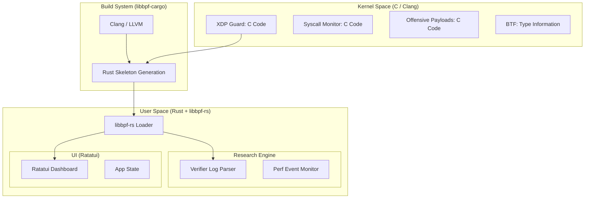

# Architecture Document: xdp-ai-guard (libbpf-rs Edition)

## 1. Overview
This project is a high-performance security and research tool for AI Inference servers. By moving to **libbpf-rs**, we utilize the official Linux user-space library for eBPF, ensuring maximum compatibility with CO-RE (Compile Once – Run Everywhere) and the most granular access to verifier logs for research purposes.

### Research Objectives
1.  **Verifier Pushback:** Capture raw `libbpf` logs to analyze rejection patterns of complex eBPF payloads.
2.  **CO-RE Boundaries:** Use `libbpf`’s relocation engine to find where kernel structure changes break offensive payloads.
3.  **Syscall Overhead:** Measure the nanosecond-level cost of eBPF-based syscall monitoring using `libbpf`'s high-performance maps.

---

## 2. Updated System Architecture

---

## 3. Component Details

### 3.1 Kernel Space (The eBPF Programs)
Since we are using `libbpf-rs`, the eBPF programs will now be written in **C**.
*   **Safety:** we will use `bpf_tracing.h` and `bpf_helpers.h`.
*   **Offensive Payloads:** Written in C to manually manipulate pointers, testing the verifier's ability to track state.
*   **CO-RE Integration:** Use `__attribute__((preserve_access_index))` on structs to test how `libbpf` handles relocations across different kernel versions.

### 3.2 Build System (`libbpf-cargo`)
The workflow changes from Aya’s `cargo xtask` to:
1.  **C Code:** Written in `src/bpf/*.bpf.c`.
2.  **Compilation:** `libbpf-cargo` compiles C to BPF bytecode using `clang`.
3.  **Skeleton:** `libbpf-cargo` generates a Rust "Skeleton" (e.g., `mod xdp_guard { ... }`). This allows you to call your C eBPF programs as native Rust structs.

### 3.3 User Space (Rust & libbpf-rs)
*   **Loader:** Uses the generated skeleton to load and attach programs.
*   **Verifier Research:** When a program fails to load, `libbpf-rs` provides the **Verifier Log Buffer**. Your Rust code will parse this buffer to identify exactly which instruction caused the "pushback."
*   **Performance Benchmarking:** Uses `RingBuffer` or `PerfBuffer` in `libblib-rs` to stream syscall timestamps from the kernel to the UI.

---

## 4. Research Implementation Plan

### A. Measuring Verifier Pushback
*   **Strategy:** Create a series of C files with increasing complexity (e.g., nested loops, deep pointer dereferencing).
*   **Measurement:** Use `libbpf_rs::ObjectBuilder` and set the log level to `4`. Capture the output when `load()` returns an error.
*   **Metric:** Document the relationship between "C Line Count/Logic Complexity" vs "Verifier Instruction Count."

### B. CO-RE Limitation Testing
*   **Strategy:** Define a struct in C that mirrors a volatile kernel struct (like `task_struct`).
*   **Test:** Attempt to load the program on an older kernel where that struct field has a different offset.
*   **Metric:** Capture `libbpf` relocation errors. Document where CO-RE successfully relocates vs. where it fails (e.g., when a field is renamed or moved to a different sub-struct).

### C. Performance Overhead (Syscall)
*   **Strategy:** Attach a `kprobe` to `sys_enter`. Inside the C code, use `bpf_ktime_get_ns()`.
*   **Measurement:** Send the delta (time between enter and exit) to Rust via a `BPF_MAP_TYPE_RINGBUF`.
*   **UI Integration:** Display the average latency in a Ratatui `Sparkline`.

---

## 5. UI Architecture (Ratatui)

The TUI will act as a "Control Center" for the research.

*   **View 1: Real-time Guard:** Shows XDP packet drop/allow stats.
*   **View 2: Verifier Lab:** A scrollable window showing the live output of the kernel verifier as you attempt to inject offensive payloads.
*   **View 3: Benchmark:** A histogram of syscall latencies.

---

## 7. Key Differences from Aya
| Feature | Aya | libbpf-rs |
| :--- | :--- | :--- |
| **Language** | 100% Rust | C (Kernel) + Rust (User) |
| **Verifier Logs** | Sometimes abstracted | Raw, verbose kernel logs |
| **CO-RE** | Handled by Aya-obj | Official libbpf relocation |
| **Stability** | Experimental | Industry Standard |
| **Kernel Headers** | Generated by Aya | `vmlinux.h` (Standard) |
