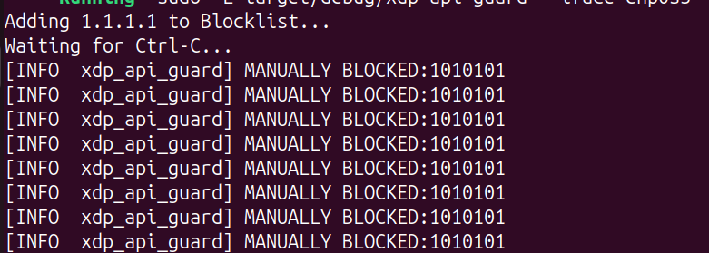
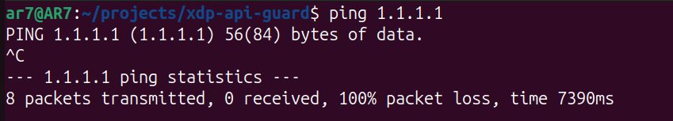
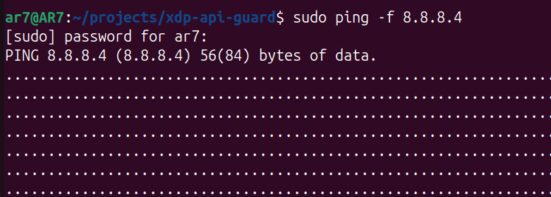
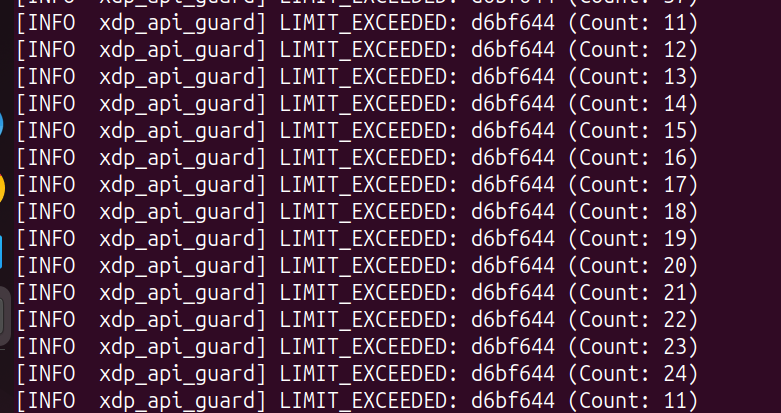

# 🛡️ xdp-ai-guard

**A high-performance Denial-of-Service (DoS) filter for AI Inference servers, written in Rust using eBPF/XDP.**


## ⚡ The Problem: GPU Cycles are Expensive
Running Large Language Models (like Llama-3-70B) is computationally expensive.
Standard firewalls (Nginx, Iptables) drop malicious packets **after** the OS has already allocated memory (`sk_buff`) and performed context switches.

If an inference server receives a flood of spam/DDoS traffic, the CPU wastes cycles processing network interrupts instead of feeding data to the GPU.

## 🚀 The Solution: XDP (eXpress Data Path)
**xdp-ai-guard** runs an eBPF program directly in the Network Interface Card (NIC) driver. It inspects and drops malicious packets **before** the Linux Kernel even sees them.

*   **Zero Allocation:** Drops packets without allocating an `sk_buff`.
*   **Line Rate:** Capable of filtering millions of packets per second.
*   **Dual-Layer Defense:** Combines a static blocklist with dynamic volumetric rate limiting.

## 📸 Demo & Evidence

### 1. Manual Blocking (Static Blocklist)
The user space agent populates a Kernel Map with known bad IPs (e.g., `1.1.1.1`). The XDP program drops them instantly.

| Kernel Logs (Blocking `1.1.1.1`) | Victim Terminal (100% Packet Loss) |
| :--- | :--- |
|  |  |

### 2. Volumetric Rate Limiting (DDoS Protection)
When a flood is detected (e.g., `sudo ping -f`), the XDP program automatically engages a Token Bucket limiter to drop excess traffic from that specific IP.

| Attacker (Ping Flood) | Kernel Logs (Rate Limit Triggered) |
| :--- | :--- |
|  |  |

---

## 🏗️ Architecture

This project uses the **Aya** framework to write eBPF logic in safe Rust.

1.  **Kernel Space (`xdp-api-guard-ebpf`):**
    *   Runs inside the kernel VM attached to the NIC.
    *   **Layer 1:** Checks Source IP against a `BLOCKLIST` HashMap.
    *   **Layer 2:** Checks packet frequency against a `RATE_LIMIT` HashMap.
    *   Returns `XDP_DROP` or `XDP_PASS`.

2.  **User Space (`xdp-api-guard`):**
    *   Loads the BPF program into the kernel.
    *   Provides a CLI to add IPs to the blocklist.
    *   Reads logs from the kernel via the `aya_log` ring buffer.

## 🛠️ Prerequisites

You need a Linux environment with a modern kernel (5.10+ recommended).

1.  **Rust Nightly:** Required for compiling BPF bytecode.
    ```bash
    rustup toolchain install nightly --component rust-src
    ```
2.  **BPF Linker:**
    ```bash
    cargo install bpf-linker
    ```
3.  **Dependencies:** `llvm`, `clang`, `libssl-dev`.

## 🏃 Usage

### 1. Build
```bash
cargo build
```

### 2. Run (Default Mode)
Monitors traffic and applies the Rate Limiter (10 packets/sec threshold).
```bash
RUST_LOG=info sudo -E cargo run --bin xdp-api-guard -- --iface enp0s3
```

### 3. Run (Manual Block Mode)
Blocks a specific IP immediately upon startup.
```bash
# Example: Block Cloudflare DNS
RUST_LOG=info sudo -E cargo run --bin xdp-api-guard -- --iface enp0s3 --block 1.1.1.1
```

## 🚧 Roadmap

*   [x] Basic XDP Pass/Drop scaffolding
*   [x] Packet Header Parsing (Eth/IPv4)
*   [x] Static Blocklist via eBPF Maps
*   [x] Dynamic Rate Limiting (Token Bucket)
*   [ ] Add JSON output for logging events to Splunk/Prometheus
*   [ ] Load Balancer logic (Layer 4 Round Robin)

## 📚 References
*   [Aya Book](https://aya-rs.dev/book/)
*   [XDP Tutorial](https://github.com/xdp-project/xdp-tutorial)
*   [Cloudflare L4Drop](https://blog.cloudflare.com/l4drop-xdp-ebpf-based-ddos-mitigations/)

## 📄 License
MIT / Apache 2.0
