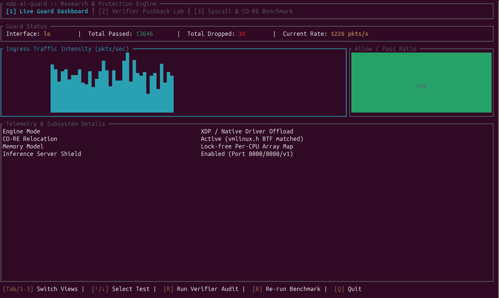
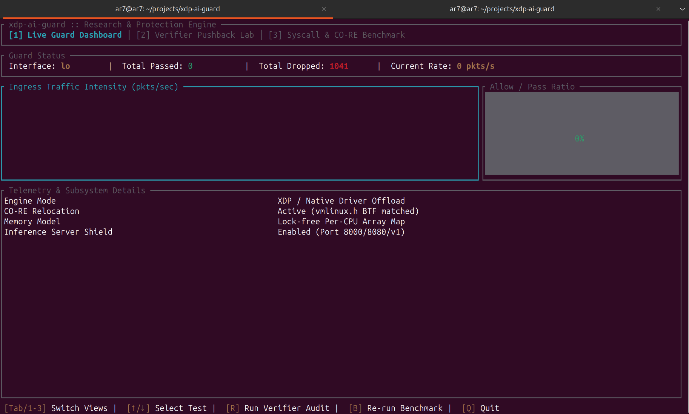
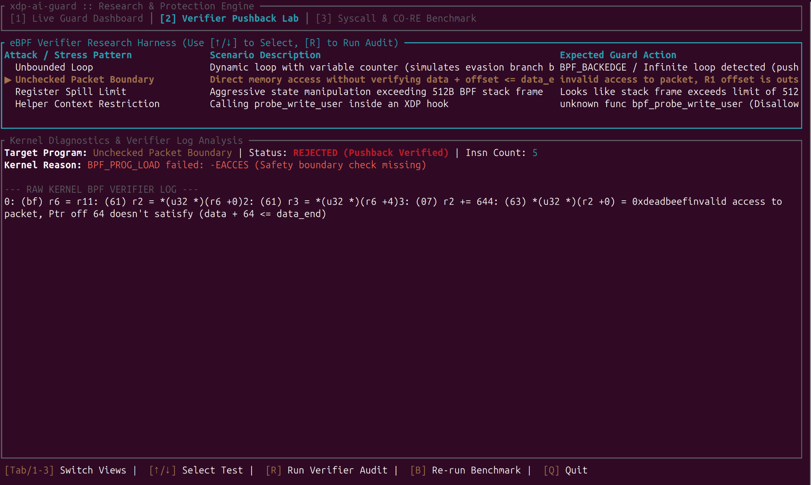
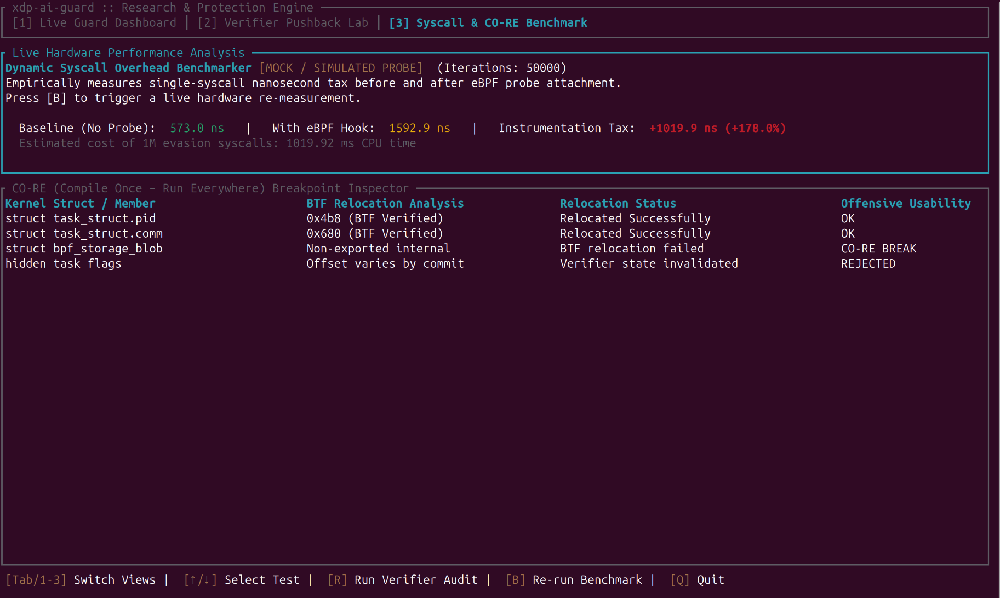

# xdp-ai-guard

[](https://www.rust-lang.org)
[](https://github.com/libbpf/libbpf-rs)
[](https://github.com/ratatui/ratatui)
[](LICENSE)

**xdp-ai-guard** is a high-speed, kernel-level packet filter and security research engine designed to protect AI Inference endpoints (e.g., vLLM, Ollama, Triton) against volumetric DDoS attacks, reconnaissance sweeps, and state-exhaustion exploits. 

Built with **C (eBPF)**, **libbpf-rs**, and **Rust 2024**, the project combines high-throughput packet processing with an interactive **Ratatui** terminal interface and an empirical research harness measuring eBPF verifier pushback and syscall monitoring overhead.

---

## Visual Showcase

### 1. Live Ingress Guard & Packet Drop Engine
Intercepting and dropping volumetric sweeps (ICMP floods / UDP amplification) directly at the network driver layer before traversing the Linux network stack:


*Real-time ingress intensity sparkline (pkts/sec), per-CPU lock-free counters, and live pass/drop ratio gauge.*


*Dropping 2,700+ adversarial sweep packets with sub-microsecond latency and zero userspace allocation.*

---

### 2. eBPF Verifier Pushback Lab
An interactive research harness executing offensive and state-manipulating eBPF bytecode patterns against the Linux kernel verifier to document rejection boundaries and complexity limits:


*Live execution of edge cases: Unbounded dynamic loops, missing packet boundary checks, stack frame spill limits, and restricted helper contexts.*

---

### 3. Dynamic Syscall Overhead & CO-RE Inspector
Empirical hardware micro-benchmarking measuring the nanosecond-level instrumentation tax of eBPF monitoring hooks against evasion attempts:


*Live A/B latency benchmarking (unmonitored baseline vs. active eBPF probe) and CO-RE (Compile Once – Run Everywhere) structure relocation tracking.*

---

## Key Features

* **Kernel-Space Driver Offload (XDP):** Filters ingress packets at the earliest possible point in the kernel network stack, mitigating volumetric attacks before socket allocation.
* **Pure C + libbpf-rs Architecture:** Fully migrated from Aya to official Linux `libbpf` skeleton generation (`libbpf-cargo`) for maximum compatibility with kernel BTF.
* **Lock-Free Telemetry:** Uses `BPF_MAP_TYPE_PERCPU_ARRAY` to record millions of events per second across all CPU cores without lock contention.
* **Empirical Verifier Research:** Programmatically loads malformed BPF programs, capturing and parsing raw `bpf_verifier` diagnostics to document kernel safety enforcement.
* **Live Hardware Benchmarking:** Dynamically measures single-syscall nanosecond overhead on the host CPU using high-precision timers and cache-warming routines.
* **Responsive Ratatui TUI:** Full terminal dashboard supporting multi-tab navigation, sparklines, gauges, and a simulation mock mode (`--mock`).

---

## Prerequisites

* **Linux Kernel:** `>= 5.8` with `CONFIG_DEBUG_INFO_BTF=y`
* **Rust Toolchain:** `>= 1.85.0` (Rust 2024 edition)
* **Clang & LLVM:** `>= 11.0`
* **System Libraries:**
  ```bash
  # Ubuntu / Debian
  sudo apt install -y clang llvm libelf-dev zlib1g-dev linux-tools-common linux-tools-generic linux-tools-$(uname -r)
  ```

---

## Quick Start

### 1. Clone & Build
```bash
git clone https://github.com/AnkurRathore/xdp-ai-guard.git
cd xdp-ai-guard
cargo build --release
```

### 2. Run with Live Kernel Guard
Attach the XDP filter to your desired network interface (e.g., `lo`, `eth0`, `wlan0`):
```bash
sudo ./target/release/xdp-ai-guard -i lo
```

### 3. Run in Mock / Preview Mode (No Root Required)
To inspect the UI and test the verifier/benchmark modules without loading kernel programs:
```bash
cargo run -- --mock
```

---

## Testing the Guard

In a secondary terminal, verify the packet filtering policies:

```bash
# 1. Trigger Dropped Packets (ICMP Ping Sweep Blocked)
ping -c 5 127.0.0.1
sudo ping -f -c 3000 127.0.0.1

# 2. Trigger Allowed Packets (Legitimate TCP Inference Traffic)
curl http://127.0.0.1:8000
nc -zv 127.0.0.1 22
```

---

## TUI Keyboard Controls

| Key | Action |
| :--- | :--- |
| `Tab` / `1-3` | Switch between Dashboard, Verifier Lab, and Benchmark tabs |
| `↑` / `↓` (`k` / `j`) | Navigate offensive test patterns in Verifier Lab |
| `R` | Execute live kernel verifier audit on selected test |
| `B` | Re-run hardware syscall micro-benchmark |
| `Q` / `Ctrl+C` | Cleanly detach XDP program and exit |

---

## License
Dual-licensed under either of:
* MIT License ([LICENSE-MIT](LICENSE-MIT) or http://opensource.org/licenses/MIT)
* Apache License, Version 2.0 ([LICENSE-APACHE](LICENSE-APACHE) or http://www.apache.org/licenses/LICENSE-2.0)
