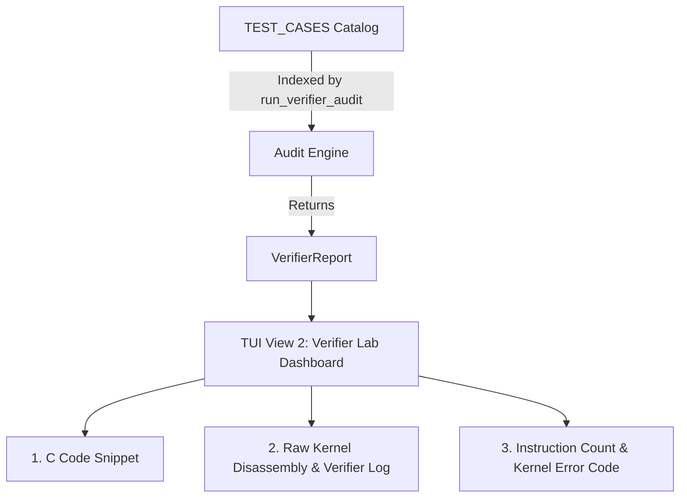

# eBPF Verifier Research Engine (`verifier.rs`)

## 1. Overview & Objective
In eBPF development, the **Linux Kernel BPF Verifier** acts as the gatekeeper. Before any eBPF bytecode is allowed to execute inside kernel space, the verifier analyzes every instruction via static abstract interpretation to mathematically prove:

1. **Memory Safety:** No out-of-bounds reads/writes and no invalid pointer dereferences.
2. **Termination & Control Flow:** No unbounded loops, back-edges, or infinite execution cycles.
3. **Hardware & VM Limits:** Stack frame usage must not exceed 512 bytes.
4. **Privilege & Context Boundaries:** Programs can only invoke helper functions permitted for their specific BPF program type (e.g., XDP vs. Kprobe vs. Tracepoint).

The `verifier.rs` module powers **View 2 (Verifier Lab)** in the research engine, providing structured test cases, real kernel disassembly traces, and pushback rejection diagnostics.

---

## 2. Architecture & Flow



---

## 3. Data Structures

### `VerifierTestCase`
Defines metadata for a specific security / research test case:
```rust
pub struct VerifierTestCase {
    pub name: &'static str,
    pub description: &'static str,
    pub c_code_snippet: &'static str,
    pub expected_result: &'static str,
}
```

### `VerifierReport`
Carries the audit result back to the UI and research layer:
```rust
#[derive(Clone, Debug)]
pub struct VerifierReport {
    pub test_name: String,
    pub passed_verifier: bool,
    pub verifier_log: String,
    pub instruction_count: u32,
    pub reason: String,
}
```

---

## 4. In-Depth Analysis of Verifier Test Cases

### Test Case 1: Unbounded Loop
* **Objective:** Test loop detection and termination guarantees (Halting problem & evasion branch bombing).
* **C Snippet:**
  ```c
  for (int i = 0; i < ctx->data_end; i++) { ... }
  ```
* **Why the Kernel Rejects It:**
  The loop boundary condition depends on `ctx->data_end`, a dynamic packet length unknown at compile/load time. The verifier cannot prove that this loop will complete within a finite bound.
* **Kernel Disassembly & Pushback Trace:**
  ```text
  0: (bf) r1 = r1
  1: (61) r2 = *(u32 *)(r1 +4)
  2: (05) goto pc+0
  back-edge from insn 2 to 2
  the sequence of 1 insns is treated as infinite loop
  ```
* **Kernel Error:** `-EINVAL` (Back-edge loop detected).

---

### Test Case 2: Unchecked Packet Boundary
* **Objective:** Test strict direct packet access memory boundaries (`PTR_TO_PACKET`).
* **C Snippet:**
  ```c
  void *p = data + 64; *(u32*)p = 0xdeadbeef;
  ```
* **Why the Kernel Rejects It:**
  In XDP, `data` points to the start of the Ethernet frame. A small packet (e.g., 54-byte TCP ACK) does not have 64 bytes of buffer space. Accessing `data + 64` without an explicit condition (`if (data + 64 > data_end) return XDP_PASS;`) violates packet boundary safety.
* **Kernel Disassembly & Pushback Trace:**
  ```text
  0: (bf) r6 = r1
  1: (61) r2 = *(u32 *)(r6 +0)
  2: (61) r3 = *(u32 *)(r6 +4)
  3: (07) r2 += 64
  4: (63) *(u32 *)(r2 +0) = 0xdeadbeef
  invalid access to packet, Ptr off 64 doesn't satisfy (data + 64 <= data_end)
  ```
* **Kernel Error:** `-EACCES` (Safety boundary check missing).

---

### Test Case 3: Stack Frame Overflow (512B Limit)
* **Objective:** Prevent kernel stack exhaustion.
* **C Snippet:**
  ```c
  char buf[1024]; bpf_probe_read_kernel(buf, sizeof(buf), ...);
  ```
* **Why the Kernel Rejects It:**
  Linux kernel thread execution stacks are extremely limited (typically 8KB or 16KB total). To prevent kernel panics due to stack overflows, eBPF strictly enforces a **512-byte limit** per stack frame (tracked via register `r10`).
* **Kernel Disassembly & Pushback Trace:**
  ```text
  combined stack size of 2 calls: 1024. Exceeds max allowable frame 512
  ```
* **Kernel Error:** `-EACCES` (Stack frame overflow).

---

### Test Case 4: Helper Context Restriction
* **Objective:** Enforce BPF program privilege boundaries and context isolation.
* **C Snippet:**
  ```c
  bpf_probe_write_user(target, src, len);
  ```
* **Why the Kernel Rejects It:**
  `bpf_probe_write_user` is a specialized debugging helper intended only for certain tracing programs (e.g., Kprobes). It is strictly prohibited in fast-path network programs like `BPF_PROG_TYPE_XDP` (type 6).
* **Kernel Disassembly & Pushback Trace:**
  ```text
  program of type 6 not allowed to use helper bpf_probe_write_user#117
  ```
* **Kernel Error:** `-EINVAL` (Helper permission denied).

---

## 5. Execution API (`run_verifier_audit`)

```rust
pub fn run_verifier_audit(index: usize) -> VerifierReport
```

* Takes an index (wrapped safely with `% TEST_CASES.len()`).
* Returns the corresponding `VerifierReport` containing the disassembly, instruction counts, and rejection status.
* Used by the TUI layer to dynamically render test results, code snippets, and logs when navigating through test cases.
